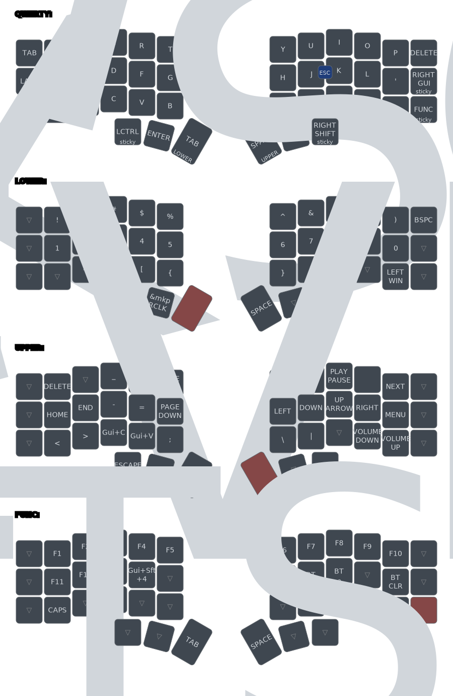

# Corne Wireless ZMK Config

Based on [markstos's layout](https://mark.stosberg.com/markstos-corne-3x5-1-keyboard-layout/), changed to my own preference.

## Keymap

## Thanks

- [n3oney/zmk-config](https://github.com/n3oney/zmk-config)
- [dapetri/zmk-config-corne](https://github.com/dapetri/zmk-config-corne)
- [nickcoutsos/keymap-editor](https://github.com/nickcoutsos/keymap-editor)
